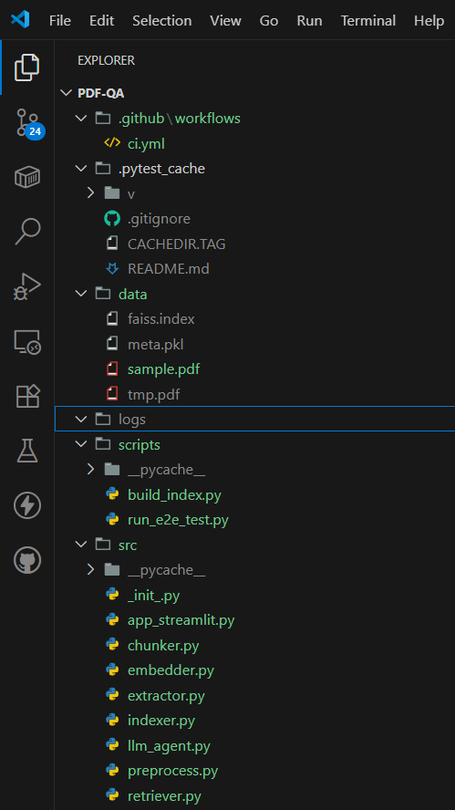
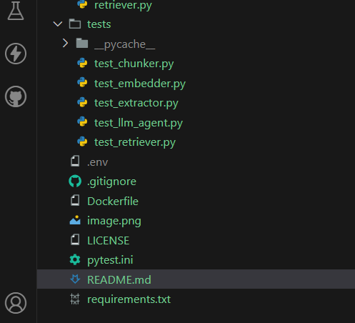

#  PDF Question Answering System using Open-Source LLMs

This project allows you to **upload a PDF document** and then **ask questions in natural English** about its content.
The system extracts the text from the PDF, indexes it, and uses a **Hugging Face LLM** to generate meaningful answers.
Just built a PDF Question Answering System using Open-Source LLMs

- What it does:

 Upload any PDF → Ask questions in plain English → Get direct answers without scanning through hundreds of pages.

- Tech Stack:

 Python | LangChain | Sentence-Transformers | FAISS | PyPDF2/pdfplumber | HuggingFace API (google/flan-t5-base) + Local Model (google/flan-t5-small) | Anaconda | Git | VS Code

- Workflow / Architecture:

 1> PDF Processing → Extract text using PyPDF2 / pdfplumber.

 2> Chunking & Embeddings → Break text into chunks → Convert chunks into vector embeddings with sentence-transformers/all-MiniLM-L6-v2.

 3> Vector Storage → Store embeddings in FAISS (vector DB) for quick similarity search.

 4> User Query → Convert question into an embedding → Retrieve the most relevant chunks from FAISS.

 5> LLM Response →

 - Primary: Hugging Face API model (google/flan-t5-base)

 - Fallback: Local model (google/flan-t5-small) → ensures reliability even if the API fails, though answer quality may be slightly lower.

- Impact:

 This system helps students quickly extract knowledge from lengthy PDFs — reducing workload and saving time.

- What excites me most is the fault-tolerant design: even if external APIs fail, the system keeps running smoothly with a local model.

---
##  Features
- Extracts text from PDFs using **pdfplumber**
- Splits content into **chunks** for better retrieval
- Uses **FAISS** for fast similarity search
- Leverages **Hugging Face Transformers API** to answer questions
- CLI-based interaction: ask questions and get AI-generated answers
- Modular, extensible, and easy to use

---
##  Project Structure

## Run the End-to-End Test
   This command verifies that your entire pipeline works from end-to-end by building an index and running a test query.
   python -m scripts.run_e2e_test

## Launch the Streamlit Web UI
   To use the interactive web application, run this command from the project root. ----  
   python -m streamlit run src/app_streamlit.py